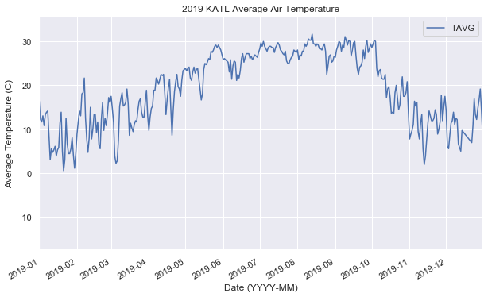
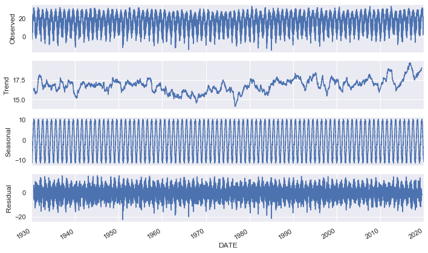
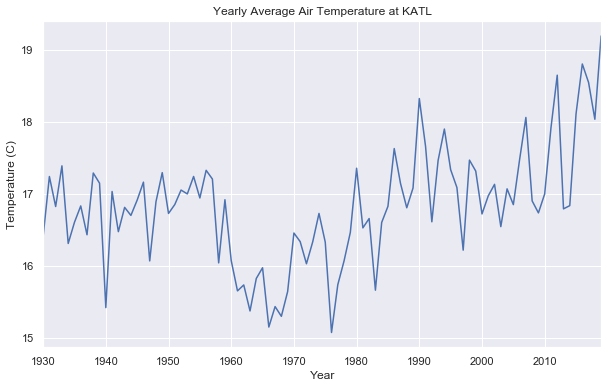
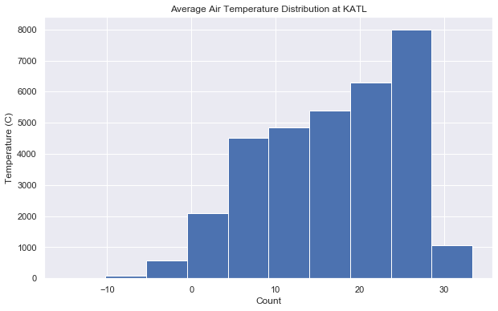
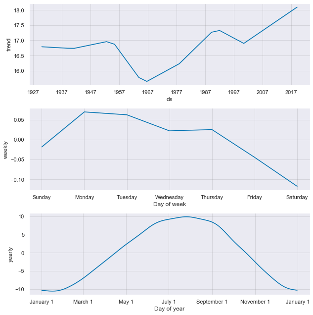
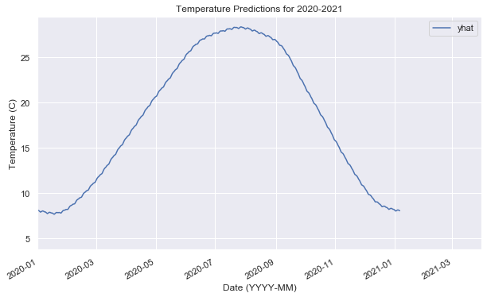

# Average Temperature Forecasting

In this notebook we will be going through the steps of loading, cleaning up, and visualizing a time series dataset to build a model which can predict daily temperatures. The data used in this notebook is from [NOAA Climate Data Online](https://www.ncdc.noaa.gov/cdo-web/datasets).

The model we will use is [Prophet](https://facebook.github.io/prophet/docs/quick_start.html) by Facebook. This model is built on top of scikit-learn and allows us to effortlessly construct models from processed time series datasets.

Model score: 78%

## Requirement
- Python 3.7+

## Tools used
- Pandas: for data manipulation
- numpy: for high performance calculations
- matplotlib, seaborn: for visualizations
- fbprophet: the forecasting model
- statsmodels: used to calculate various statistical quantities useful for determining if the data is valid
- datetime: handle date in time series dataset
- sklearn metrics: scoring our model

## Files
- atlanta_data.csv

    NOAA Hartsfield–Jackson Atlanta International Airport Climate data from 1930 - 2020. [Documentation]   (https://www1.ncdc.noaa.gov/pub/data/cdo/documentation/GHCND_documentation.pdf)

- model.ipynb

    the source code


```python
%matplotlib inline
import pandas as pd
import numpy as np
import matplotlib as mpl
import matplotlib.pyplot as plt
import seaborn as sns
from fbprophet import Prophet
import statsmodels.api as sm # Time series analysis
import datetime

from sklearn.metrics import r2_score

pd.plotting.register_matplotlib_converters()
mpl.rcParams["figure.figsize"]=[10,6]
sns.set()
```

# Loading Data and Preprocessing


```python
df = pd.read_csv("atlanta_data.csv", index_col="DATE", parse_dates=True, usecols=["DATE", "TMIN", "TMAX"])

#df["DATE"] = pd.to_datetime(df["DATE"], format="%Y-%m-%d")

# Calculate the average temperature
t_avg = lambda row: (row["TMIN"] + row["TMAX"]) / 2
f_to_c = lambda row: float(((row["TAVG"] - 32) * 5 / 9))

df["TAVG"] = df.apply(t_avg, axis=1)
df = df[["TAVG"]]
df = df.dropna()

df["TAVG"] = (df["TAVG"] - 32) * 5 / 9

print("Null values:")
df.isnull().sum()
```

    Null values:


    TAVG    0
    dtype: int64


```python
df.info()
```

    <class 'pandas.core.frame.DataFrame'>
    DatetimeIndex: 32871 entries, 1930-01-01 to 2020-01-07
    Data columns (total 1 columns):
    TAVG    32871 non-null float64
    dtypes: float64(1)
    memory usage: 513.6 KB


```python
df.head()
```


<div>
<style scoped>
    .dataframe tbody tr th:only-of-type {
        vertical-align: middle;
    }

    .dataframe tbody tr th {
        vertical-align: top;
    }

    .dataframe thead th {
        text-align: right;
    }
</style>
<table border="1" class="dataframe">
  <thead>
    <tr style="text-align: right;">
      <th></th>
      <th>TAVG</th>
    </tr>
    <tr>
      <th>DATE</th>
      <th></th>
    </tr>
  </thead>
  <tbody>
    <tr>
      <th>1930-01-01</th>
      <td>12.500000</td>
    </tr>
    <tr>
      <th>1930-01-02</th>
      <td>14.444444</td>
    </tr>
    <tr>
      <th>1930-01-03</th>
      <td>5.833333</td>
    </tr>
    <tr>
      <th>1930-01-04</th>
      <td>3.333333</td>
    </tr>
    <tr>
      <th>1930-01-05</th>
      <td>5.000000</td>
    </tr>
  </tbody>
</table>
</div>


# Data Visualization


```python
def vis(df):
    ax = df.plot()
    ax.set_xlim(pd.Timestamp("2019-01-01"), pd.Timestamp("2019-12-31"))
    ax.set_title("2019 KATL Average Air Temperature")
    ax.set_xlabel("Date (YYYY-MM)")
    ax.set_ylabel("Average Temperature (C)")
vis(df)
```





There are four components to time series,
1. Trend: Long time pattern (increase / decrease) of the series.
2. Seasonality: Repeating cycles. For example, increase of temperatures every year during the summer months.
3. Cyclical: Up down patterns of the series.
4. Noise: Random variation.

We can get a visualization of these quantities using the statsmodel library.


```python
def show_seasonal_decompose(df):
    decomp = sm.tsa.seasonal_decompose(df, model="additive", freq=365)
    decomp.plot()
show_seasonal_decompose(df)
```





```python
def plot_yearly_avg(df):
    df_cpy = df.copy()
    df_cpy = df.sort_index()

    g = df_cpy.groupby(df.index.year)["TAVG"].mean()
    g = g.drop(g.tail(1).index) # We only keep data up to 2019 since 2020 data is imcomplete

    ax = g.plot()
    ax.set_title("Yearly Average Air Temperature at KATL")
    ax.set_xlabel("Year")
    ax.set_ylabel("Temperature (C)")
```


```python
plot_yearly_avg(df)
```


Interesting

# Stationary Assumption for Time Series Models
Most time series (TS) models require that the data be stationary to work well. When a dataset is stationary, its statistical quantities are constant over the time period of the data. For example, the mean, variance, and autocovariance are constant.

We want our data to be stationary so our model can accurately predict data at *all* points of interest.


Let's take a look at our yearly average data again...


```python
plot_yearly_avg(df)
```





This plot shows trend and seasonal effects on the data. Statistics are not consistent over time. There is also a trend change at around 1960.


```python
def print_stats(df):
    df_cpy = df.copy()
    X = df_cpy.values
    split = len(X) // 2
    X1, X2 = X[0: split], X[split:]
    mean1, mean2 = X1.mean(), X2.mean()
    var1, var2 = X1.var(), X2.var()
    print("Mean: X1 = {}, X2 = {}".format(mean1, mean2))
    print("Variance: X1 = {}, X2 = {}".format(var1, var2))
    
print_stats(df)
```

    Mean: X1 = 16.50358313896495, X2 = 17.147487899191475
    Variance: X1 = 69.76077695405178, X2 = 69.51663940682006


```python
def plot_dist(df):
    ax = df.hist()
    ax[0][0].set_title("Average Air Temperature Distribution at KATL")
    ax[0][0].set_xlabel("Count")
    ax[0][0].set_ylabel("Temperature (C)")

plot_dist(df)
```





Our histogram shows a **truncated normal distribution**. This is another sign of non stationary data. We can also run an Augmented Dickey-Fuller Test to determine if our data has a unit root. The presence of a unit root indicates a stochastic, or random trend in the data. This means non-stationary data!


```python
def print_adfuller(df):
    df_cpy = df.copy()
    print("Dickey-Fuller Test")
    results = sm.tsa.stattools.adfuller(df_cpy["TAVG"])
    print("df (test Statistic) = {}".format(results[0]))
    print("pvalue = {}".format(results[1]))
    print("lags = {}".format(results[2]))
    print("nobs = {}".format(results[3]))

    for key, value in results[4].items():
        print("{} = {}".format(key, value))
    
print_adfuller(df)
```

    Dickey-Fuller Test
    df (test Statistic) = -15.695048869571698
    pvalue = 1.4184890941268057e-28
    lags = 52
    nobs = 32818
    1% = -3.4305492751405127
    5% = -2.8616280745033746
    10% = -2.566816879322118


Our test statistic is much greater than our critical values (absolute), therefore this series is non stationary based on the Dickey-Fuller test.


```python
def print_kpss(df):
    df_cpy = df.copy()
    print("KPSS Test")
    results = sm.tsa.stattools.kpss(df_cpy["TAVG"], regression="c", lags="auto")
    print("df (test Statistic) = {}".format(results[0]))
    print("pvalue = {}".format(results[1]))
    print("lags = {}".format(results[2]))

    for key, value in results[3].items():
        print("{} = {}".format(key, value))
print_kpss(df)
```

    KPSS Test
    df (test Statistic) = 0.1233751698176346
    pvalue = 0.1
    lags = 107
    10% = 0.347
    5% = 0.463
    2.5% = 0.574
    1% = 0.739


    /Users/nigelhuang/opt/anaconda3/envs/tf/lib/python3.7/site-packages/statsmodels/tsa/stattools.py:1710: InterpolationWarning: p-value is greater than the indicated p-value
      warn("p-value is greater than the indicated p-value", InterpolationWarning)


The KPSS test concludes that our series is stationary. Since the KPSS test for stationary is positive and the DF test is negative, it means we have a trend stationary.

# Model Training

Before we start to train our model, we need to partition our data so we can test our model's accuracy later. Here, we will put aside the the 2018-2019 data for testing the model later. We have lots of data so not applying the 80:20 rule is fine here.


```python
total_rows = len(df)
train_df, test_df = df[:"2017-12-31"], df["2018-01-01":]
print("train shape: {} ({}% of data)".format(train_df.shape, train_df.shape[0] / total_rows))
print("test shape: {} ({}% of data)".format(test_df.shape, test_df.shape[0] / total_rows))
```

    train shape: (32141, 1) (0.9777919746889355% of data)
    test shape: (730, 1) (0.022208025311064465% of data)


```python
# Model
# Note: fbprophet model requires the X and y columns to be named ds and y, respectively
train_df = train_df.reset_index()
train_df = train_df.rename(columns={"DATE": "ds", "TAVG": "y"})

model = Prophet()
model.fit(train_df)
```

# Model Evaluation

Time to bring back our test dataset that we put aside.


```python
test_df = test_df.rename(columns={"DATE": "ds", "TAVG": "y"})
test_pred = model.predict(test_df)

model_score = r2_score(test_df["y"], test_pred["yhat"])
print(model_score)
```

    0.7822734381613698


```python
# Try to make some future + overlapping predictions to see how our model fits
future_df = model.make_future_dataframe(periods=365) # +1 year of data!
```


```python
prediction = model.predict(future_df)
model.plot_components(prediction); # <- https://github.com/facebook/prophet/issues/124
```





```python
ax6 = prediction.plot(x="ds", y="yhat")
ax6.set_xlim(pd.Timestamp("2020-01-01"), pd.Timestamp("2021-03-31"))
ax6.set_xlabel("Date (YYYY-MM)")
ax6.set_ylabel("Temperature (C)")
ax6.set_title("Temperature Predictions for 2020-2021")
```


    Text(0.5, 1.0, 'Temperature Predictions for 2020-2021')




